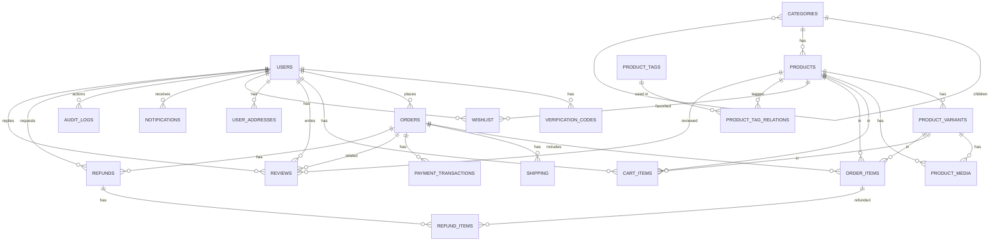
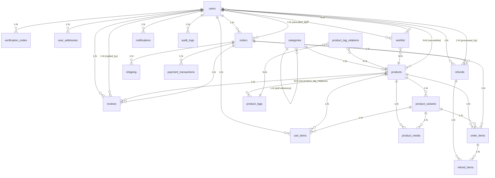

## Cấu trúc Database – XgameProject (PostgreSQL)

Tài liệu này mô tả cấu trúc CSDL hiện tại (theo `database_schema.dbml` và các file migration trong `src/connections/db/migrations`).

---

## 1. Tổng quan

- **Hệ quản trị CSDL**: PostgreSQL (CSDL quan hệ dùng ngôn ngữ SQL)  
- **Kiểu khóa chính**:  
  - `users.id`: `UUID` (sinh bằng `uuid_generate_v4()`)  
  - Các bảng còn lại: `SERIAL` / `INTEGER` làm khóa chính.  
- **Enum**:
  - `user_status`: `active | banned | deleted`
  - `verification_code_type`: `phone | verify_email | change_phone | password_reset | "2fa"`
  - `notification_type`: `order_placed | order_shipped | order_delivered | order_cancelled | payment_success | payment_failed | review_request`
- **Tính năng nổi bật**:
  - Soft delete trên nhiều bảng (`deleted_at`).  
  - Full-text search với `tsvector` (`products.search_vector`) + GIN index.  
  - Semantic search với `embedding vector(1536)` (yêu cầu extension **pgvector**).  
  - Hệ thống index phong phú cho filter, sort, truy vấn theo trạng thái/điều kiện.  

Sơ bộ, hệ thống bao gồm các nhóm bảng:

- **User & Auth**: `users`, `verification_codes`, `user_addresses`  
- **Sản phẩm & danh mục**: `categories`, `products`, `product_variants`, `product_media`, `product_tags`, `product_tag_relations`  
- **Giỏ hàng & Wishlist**: `cart_items`, `wishlist`  
- **Đơn hàng & thanh toán**: `orders`, `order_items`, `shipping`, `payment_transactions`, `refunds`, `refund_items`  
- **Tương tác & hệ thống**: `reviews`, `notifications`, `audit_logs`  

Tổng cộng hiện có **19 bảng** (không tính migration enable vector).

### 1.1. Sơ đồ quan hệ (ERD – dạng Mermaid)

Bạn có thể copy block dưới đây dán vào `https://mermaid.live` để xem sơ đồ:



---

## 2. Chi tiết từng bảng

### 2.1. Bảng `users`

**Mục đích**: Lưu thông tin tài khoản người dùng.

**Các cột chính**:

- `id` (`uuid`, PK, default `uuid_generate_v4()`)
- `phone` (`varchar(15)`, **unique**, **not null**) – số điện thoại đăng ký tài khoản
- `email` (`varchar(255)`, unique, nullable)
- `password_hash` (`varchar(255)`, **not null**)
- `full_name` (`varchar(255)`)
- `avatar_url` (`varchar(500)`)
- `phone_verified` (`boolean`, default `false`)
- `email_verified` (`boolean`, default `false`)
- `status` (`user_status`, default `'active'`)
- `role` (`varchar(20)`, default `'customer'`) – ví dụ: `customer`, `admin`
- `date_of_birth` (`date`)
- `gender` (`varchar(10)`)
- `last_login_at` (`timestamp`)
- `created_at`, `updated_at` (`timestamp`, default `CURRENT_TIMESTAMP`)

**Index**:

- `idx_users_phone` trên `phone`  
- `idx_users_email` trên `email`  
- `idx_users_role` trên `role`  
- `idx_users_status` trên `status`  
- `idx_users_role_status` trên `(role, status)`  
- `idx_users_active_status` trên `status` (partial: `WHERE status = 'active'`)  
- `idx_users_last_login` trên `last_login_at DESC`  

**Quan hệ**:

- Được tham chiếu bởi: `verification_codes.user_id`, `orders.user_id`, `orders.cancelled_by`, `cart_items.user_id`, `reviews.user_id`, `reviews.replied_by`, `refunds.user_id`, `refunds.processed_by`, `user_addresses.user_id`, `wishlist.user_id`, `notifications.user_id`, `audit_logs.user_id`.  

---

### 2.2. Bảng `verification_codes`

**Mục đích**: Lưu mã OTP/verification dùng cho đăng ký, xác thực email, đổi SĐT, reset mật khẩu, 2FA.

**Các cột chính**:

- `id` (`integer`, PK)  
- `user_id` (`uuid`, FK → `users.id`) – có thể `NULL` tùy `type`  
- `contact_value` (`varchar(255)`, **not null**) – giá trị liên hệ (phone/email)  
- `code` (`varchar(10)`, **not null**) – mã OTP  
- `type` (`verification_code_type`, **not null**)  
- `expires_at` (`timestamp`, **not null**)  
- `is_used` (`boolean`, default `false`)  
- `attempts` (`integer`, default `0`)  
- `created_at` (`timestamp`, default `CURRENT_TIMESTAMP`)  

**Ràng buộc nghiệp vụ (note)**:

- `type = 'phone'` → `user_id IS NULL`  
- `type != 'phone'` → `user_id IS NOT NULL`  

**Index**:

- `idx_verification_codes_user` trên `user_id`  
- `idx_verification_codes_contact` trên `contact_value`  
- `idx_verification_codes_code` trên `code`  
- `idx_verification_codes_type_expires` trên `(type, expires_at)`  
- `idx_verification_codes_contact_type` trên `(contact_value, type)`  

---

### 2.3. Bảng `categories`

**Mục đích**: Danh mục sản phẩm dạng cây (category cha - con).

**Các cột chính**:

- `id` (`integer`, PK)  
- `parent_id` (`integer`, FK → `categories.id`, có thể `NULL` cho danh mục gốc)  
- `name` (`varchar(255)`, **not null**)  
- `slug` (`varchar(255)`, **unique**, **not null**)  
- `image_url` (`varchar(500)`)  
- `description` (`text`)  
- `display_order` (`integer`, default `0`)  
- `is_active` (`boolean`, default `true`)  
- `created_at`, `updated_at` (`timestamp`, default `CURRENT_TIMESTAMP`)  
- `deleted_at` (`timestamp`, soft delete)  

**Index**:

- `idx_categories_parent` trên `parent_id`  
- `idx_categories_slug` trên `slug`  
- `idx_categories_active` trên `(is_active, deleted_at)`  
- `idx_categories_display_order` trên `(display_order, is_active)` (partial: `WHERE deleted_at IS NULL`)  

**Quan hệ**:

- 1 category có thể có nhiều category con (`parent_id`).  
- `products.category_id` tham chiếu đến `categories.id`.  

---

### 2.4. Bảng `products`

**Mục đích**: Lưu thông tin sản phẩm gốc.

**Các cột chính**:

- `id` (`integer`, PK, `SERIAL`)  
- `category_id` (`integer`, FK → `categories.id`)  
- `sku` (`varchar(100)`, unique, nullable)  
- `name` (`varchar(255)`, **not null**)  
- `description` (`text`)  
- `price` (`integer`, **not null**) – giá gốc (VND)  
- `stock_quantity` (`integer`, default `0`)  
- `brand` (`varchar(100)`)  
- `view_count` (`integer`, default `0`)  
- `sold_count` (`integer`, default `0`)  
- `is_active` (`boolean`, default `true`)  
- `search_vector` (`tsvector`) – dùng cho full-text search (có trigger cập nhật)  
- `embedding` (`vector(1536)`) – dùng cho semantic search (OpenAI ada-002)  
- `created_at`, `updated_at` (`timestamp`, default `CURRENT_TIMESTAMP`)  
- `deleted_at` (`timestamp`, soft delete)  

**Index**:

- `idx_products_category` trên `category_id`  
- `idx_products_name` trên `name`  
- `idx_products_price` trên `price`  
- `idx_products_created_at` trên `created_at DESC`  
- `idx_products_active` trên `is_active` (partial: `WHERE is_active = true`)  
- `idx_products_sku` trên `sku` (partial: `WHERE sku IS NOT NULL`)  
- `idx_products_search_vector` trên `search_vector` (GIN index)  
- `idx_products_category_active` trên `(category_id, is_active)` (partial: `WHERE is_active = true`)  
- `idx_products_price_range` trên `(price, category_id)` (partial: `WHERE is_active = true`)  
- `idx_products_embedding` trên `embedding` (HNSW – pgvector)  

**Quan hệ**:

- 1 product có nhiều `product_variants`, `product_media`, `cart_items`, `order_items`, `wishlist`, `reviews`, `product_tag_relations`.  

---

### 2.5. Bảng `product_variants`

**Mục đích**: Biến thể sản phẩm (màu sắc, kích thước…).

**Các cột chính**:

- `id` (`integer`, PK, `SERIAL`)  
- `product_id` (`integer`, FK → `products.id` ON DELETE CASCADE)  
- `sku` (`varchar(100)`, unique, nullable) – SKU riêng cho biến thể  
- `variant_type` (`varchar(50)`, **not null**) – ví dụ: `color`, `size`  
- `variant_value` (`varchar(100)`, **not null**) – ví dụ: `red`, `L`  
- `price_adjustment` (`integer`, default `0`) – chênh lệch giá so với `products.price`  
- `stock_quantity` (`integer`, default `0`)  
- `image_url` (`varchar(500)`) – ảnh riêng cho biến thể  
- `is_active` (`boolean`, default `true`)  
- `created_at`, `updated_at` (`timestamp`, default `CURRENT_TIMESTAMP`)  
- `deleted_at` (`timestamp`, soft delete)  

**Ràng buộc & index**:

- Constraint `unique_product_variant` trên `(product_id, variant_type, variant_value)` – không trùng biến thể.  
- `idx_product_variants_product` trên `product_id`  
- `idx_product_variants_sku` trên `sku` (partial: `WHERE sku IS NOT NULL`)  
- `idx_product_variants_type` trên `variant_type`  
- `idx_product_variants_active` trên `(is_active, deleted_at)`  
- `idx_product_variants_product_active` trên `(product_id, is_active)` (partial: `WHERE deleted_at IS NULL`)  

---

### 2.6. Bảng `product_media`

**Mục đích**: Lưu media (ảnh/video) cho sản phẩm và biến thể.

**Các cột chính**:

- `id` (`integer`, PK, `SERIAL`)  
- `product_id` (`integer`, FK → `products.id` ON DELETE CASCADE)  
- `variant_id` (`integer`, FK → `product_variants.id` ON DELETE CASCADE, có thể `NULL`)  
- `type` (`varchar(20)`, default `'image'`) – loại media (image/video/…)  
- `image_url` (`varchar(500)`, **not null**)  
- `alt_text` (`varchar(255)`)  
- `display_order` (`integer`, default `0`) – thứ tự hiển thị  
- `is_primary` (`boolean`, default `false`) – đánh dấu ảnh đại diện  
- `created_at` (`timestamp`, default `CURRENT_TIMESTAMP`)  

**Index**:

- `idx_product_media_product` trên `product_id`  
- `idx_product_media_variant` trên `variant_id`  
- `idx_product_media_primary` trên `(product_id, is_primary)`  

---

### 2.7. Bảng `product_tags` & `product_tag_relations`

#### `product_tags`

**Mục đích**: Danh sách tag (nhãn) sản phẩm.

- `id` (`integer`, PK)  
- `name` (`varchar(100)`, **unique**, **not null**)  
- `slug` (`varchar(100)`, **unique**, **not null**)  
- `created_at` (`timestamp`, default `CURRENT_TIMESTAMP`)  

#### `product_tag_relations`

**Mục đích**: Bảng nối N-N giữa `products` và `product_tags`.

- `product_id` (`integer`, FK → `products.id`)  
- `tag_id` (`integer`, FK → `product_tags.id`)  
- `created_at` (`timestamp`, default `CURRENT_TIMESTAMP`)  
- PK & unique composite `(product_id, tag_id)`  
- Index:  
  - `idx_product_tag_relations_product` trên `product_id`  
  - `idx_product_tag_relations_tag` trên `tag_id`  

---

### 2.8. Bảng `cart_items`

**Mục đích**: Giỏ hàng của người dùng (chưa thanh toán).

**Các cột chính**:

- `id` (`integer`, PK, `SERIAL`)  
- `user_id` (`uuid`, FK → `users.id` ON DELETE CASCADE)  
- `product_id` (`integer`, FK → `products.id` ON DELETE CASCADE)  
- `variant_id` (`integer`, FK → `product_variants.id`, nullable)  
- `quantity` (`integer`, **not null**, default `1`)  
- `created_at`, `updated_at` (`timestamp`, default `CURRENT_TIMESTAMP`)  

**Ràng buộc & index**:

- Unique `(user_id, product_id, variant_id)` – 1 user chỉ có 1 dòng cho mỗi combo sản phẩm/biến thể.  
- `idx_cart_items_user` trên `user_id`.  

---

### 2.9. Bảng `orders`

**Mục đích**: Đơn hàng sau khi user checkout.

**Các cột chính**:

- `id` (`integer`, PK, `SERIAL`)  
- `user_id` (`uuid`, FK → `users.id` ON DELETE SET NULL`)  
- `order_number` (`varchar(50)`, **unique**, **not null**)  
- Giá trị đơn hàng:
  - `subtotal` (`decimal(10,2)`, **not null**) – tổng tiền hàng trước giảm giá, thuế, phí  
  - `discount_amount` (`decimal(10,2)`, default `0`)  
  - `tax_amount` (`decimal(10,2)`, default `0`)  
  - `shipping_fee` (`decimal(10,2)`, default `0`)  
  - `total_amount` (`decimal(10,2)`, **not null**)  
- Thông tin giao hàng & thanh toán:
  - `shipping_address` (`text`, **not null**) – địa chỉ giao hàng snapshot  
  - `payment_method` (`varchar(50)`, **not null**)  
  - `payment_status` (`varchar(20)`, default `'pending'`)  
  - `order_status` (`varchar(20)`, default `'pending'`)  
- Hủy & ghi chú:
  - `cancelled_at` (`timestamp`)  
  - `cancelled_by` (`uuid`, FK → `users.id` ON DELETE SET NULL`)  
  - `cancellation_reason` (`text`)  
- Khác:
  - `delivery_date` (`date`)  
  - `notes` (`text`)  
  - `created_at`, `updated_at` (`timestamp`, default `CURRENT_TIMESTAMP`)  
  - `deleted_at` (`timestamp`, soft delete)  

**Index**:

- `idx_orders_user` trên `user_id`  
- `idx_orders_status` trên `order_status`  
- `idx_orders_payment_status` trên `payment_status`  
- `idx_orders_created_at` trên `created_at DESC`  
- `idx_orders_order_number` trên `order_number`  

---

### 2.10. Bảng `order_items`

**Mục đích**: Chi tiết sản phẩm trong từng đơn hàng.

**Các cột chính**:

- `id` (`integer`, PK, `SERIAL`)  
- `order_id` (`integer`, FK → `orders.id` ON DELETE CASCADE`)  
- `product_id` (`integer`, FK → `products.id`)  
- `variant_id` (`integer`, FK → `product_variants.id`)  
- `quantity` (`integer`, **not null**)  
- `price` (`integer`, **not null**) – đơn giá VND tại thời điểm đặt hàng  
- `created_at` (`timestamp`, default `CURRENT_TIMESTAMP`)  

**Index**:

- `idx_order_items_order` trên `order_id`  
- `idx_order_items_product` trên `product_id`  

---

### 2.11. Bảng `shipping`

**Mục đích**: Thông tin vận chuyển gắn với đơn hàng.

**Các cột chính**:

- `id` (`integer`, PK)  
- `order_id` (`integer`, FK → `orders.id` ON DELETE CASCADE`)  
- `shipping_provider` (`varchar(50)`)  
- `tracking_number` (`varchar(100)`)  
- `shipping_fee` (`decimal(10,2)`, **not null**)  
- `estimated_delivery_date` (`timestamp`)  
- `status` (`varchar(20)`, default `'pending'`) – `pending | picked_up | in_transit | delivered | failed | returned`  
- `notes` (`text`)  
- `created_at`, `updated_at` (`timestamp`, default `CURRENT_TIMESTAMP`)  

**Index**:

- `idx_shipping_order` trên `order_id`  
- `idx_shipping_tracking` trên `tracking_number`  

---

### 2.12. Bảng `payment_transactions`

**Mục đích**: Lưu thông tin giao dịch thanh toán từ các cổng thanh toán online (VD: VNPay, ZaloPay,...).

**Các cột chính**:

- `id` (`integer`, PK)  
- `order_id` (`integer`, FK → `orders.id` ON DELETE CASCADE`)  
- `transaction_id` (`varchar(100)`, **unique**)  
- `payment_gateway` (`varchar(50)`, **not null**) – tên cổng thanh toán  
- `amount` (`decimal(10,2)`, **not null**)  
- `status` (`varchar(20)`, **not null**, default `'pending'`)  
- `response_data` (`jsonb`) – dữ liệu phản hồi từ cổng thanh toán  
- `error_message` (`text`)  
- `created_at`, `updated_at` (`timestamp`, default `CURRENT_TIMESTAMP`)  

**Index**:

- `idx_payment_transactions_order` trên `order_id`  
- `idx_payment_transactions_transaction_id` trên `transaction_id`  
- `idx_payment_transactions_status` trên `status`  
- `idx_payment_transactions_gateway` trên `payment_gateway`  
- `idx_payment_transactions_created_at` trên `created_at`  

---

### 2.13. Bảng `reviews`

**Mục đích**: Đánh giá sản phẩm sau khi mua.

**Các cột chính**:

- `id` (`integer`, PK, `SERIAL`)  
- `user_id` (`uuid`, FK → `users.id` ON DELETE SET NULL`)  
- `product_id` (`integer`, FK → `products.id`)  
- `order_id` (`integer`, FK → `orders.id`)  
- `rating` (`integer`, CHECK `1 <= rating <= 5`)  
- `comment` (`text`)  
- `image_urls` (`text[]`) – danh sách URL ảnh review  
- `video_url` (`varchar(500)`)  
- Phản hồi từ shop:
  - `reply` (`text`)  
  - `replied_at` (`timestamp`)  
  - `replied_by` (`uuid`, FK → `users.id` ON DELETE SET NULL`)  
- Tương tác:
  - `helpful_count` (`integer`, default `0`)  
  - `is_approved` (`boolean`, default `true`)  
- `created_at`, `updated_at` (`timestamp`, default `CURRENT_TIMESTAMP`)  
- `deleted_at` (`timestamp`, soft delete)  

**Ràng buộc & index**:

- Unique `(user_id, product_id, order_id)` – mỗi user chỉ review 1 lần cho một sản phẩm trong một đơn hàng.  
- `idx_reviews_product` trên `product_id`  
- `idx_reviews_rating` trên `rating`  
- `idx_reviews_created_at` trên `created_at DESC`  
- `idx_reviews_product_rating` trên `(product_id, rating)`  

---

### 2.14. Bảng `refunds` & `refund_items`

#### `refunds`

**Mục đích**: Quản lý yêu cầu hoàn tiền/đổi trả.

**Các cột chính**:

- `id` (`integer`, PK)  
- `refund_number` (`varchar(50)`, **unique**, **not null**)  
- `order_id` (`integer`, FK → `orders.id` ON DELETE CASCADE`)  
- `user_id` (`uuid`, FK → `users.id` ON DELETE CASCADE`)  
- `type` (`varchar(20)`, **not null**) – `refund | return | exchange`  
- `reason` (`text`, **not null**)  
- `status` (`varchar(20)`, default `'pending'`) – `pending | approved | rejected | processing | completed | cancelled`  
- `refund_amount` (`decimal(10,2)`)  
- `admin_notes` (`text`)  
- `processed_by` (`uuid`, FK → `users.id`)  
- `processed_at` (`timestamp`)  
- `created_at`, `updated_at` (`timestamp`, default `CURRENT_TIMESTAMP`)  

**Index**:

- `idx_refunds_order` trên `order_id`  
- `idx_refunds_user` trên `user_id`  
- `idx_refunds_status` trên `status`  

#### `refund_items`

**Mục đích**: Chi tiết từng dòng hàng trong yêu cầu hoàn tiền.

- `id` (`integer`, PK)  
- `refund_id` (`integer`, FK → `refunds.id` ON DELETE CASCADE`)  
- `order_item_id` (`integer`, FK → `order_items.id` ON DELETE CASCADE`)  
- `quantity` (`integer`, **not null**)  
- `refund_amount` (`decimal(10,2)`, **not null**)  
- `reason` (`text`)  
- `created_at` (`timestamp`, default `CURRENT_TIMESTAMP`)  
- Index: `idx_refund_items_refund` trên `refund_id`  

---

### 2.15. Bảng `user_addresses`

**Mục đích**: Lưu nhiều địa chỉ giao hàng cho mỗi user.

**Các cột chính**:

- `id` (`integer`, PK, `SERIAL`)  
- `user_id` (`uuid`, FK → `users.id` ON DELETE CASCADE`)  
- `full_name` (`varchar(255)`, **not null**)  
- `phone` (`varchar(10)`, **not null**)  
- `province` (`varchar(100)`, **not null**)  
- `district` (`varchar(100)`, **not null**)  
- `ward` (`varchar(100)`, **not null**)  
- `street_address` (`text`, **not null**)  
- `is_default` (`boolean`, default `false`)  
- `created_at`, `updated_at` (`timestamp`, default `CURRENT_TIMESTAMP`)  
- `deleted_at` (`timestamp`, soft delete)  

**Index**:

- `idx_user_addresses_user` trên `user_id`  
- `idx_user_addresses_default` trên `(user_id, is_default)`  
- `idx_user_addresses_deleted_at` trên `deleted_at`  
- `idx_user_addresses_user_not_deleted` trên `(user_id, deleted_at)`  

---

### 2.16. Bảng `wishlist`

**Mục đích**: Danh sách sản phẩm yêu thích của người dùng.

**Các cột chính**:

- `id` (`integer`, PK, `SERIAL`)  
- `user_id` (`uuid`, FK → `users.id` ON DELETE CASCADE`)  
- `product_id` (`integer`, FK → `products.id` ON DELETE CASCADE`)  
- `created_at` (`timestamp`, default `CURRENT_TIMESTAMP`)  

**Ràng buộc & index**:

- Unique `(user_id, product_id)` – 1 user không thể thêm trùng cùng 1 sản phẩm vào wishlist.  
- `idx_wishlist_user` trên `user_id`  
- `idx_wishlist_product` trên `product_id`  

---

### 2.17. Bảng `notifications`

**Mục đích**: Thông báo cho người dùng về các sự kiện (đơn hàng, thanh toán, khuyến mãi, hệ thống…).

**Các cột chính**:

- `id` (`integer`, PK)  
- `user_id` (`uuid`, FK → `users.id` ON DELETE CASCADE`)  
- `type` (`notification_type`, **not null**)  
- `title` (`varchar(255)`, **not null**)  
- `message` (`text`, **not null**)  
- `link` (`varchar(500)`) – URL chi tiết (ví dụ link tới đơn hàng, bài viết…)  
- `is_read` (`boolean`, default `false`)  
- `created_at` (`timestamp`, default `CURRENT_TIMESTAMP`)  

**Index**:

- `idx_notifications_user` trên `user_id`  
- `idx_notifications_type` trên `type`  
- `idx_notifications_is_read` trên `is_read`  

---

### 2.18. Bảng `audit_logs`

**Mục đích**: Lưu lại log audit cho các thao tác quan trọng (thay đổi dữ liệu, hành động nhạy cảm).

**Các cột chính**:

- `id` (`integer`, PK)  
- `user_id` (`uuid`, FK → `users.id` ON DELETE SET NULL`) – ai thực hiện hành động  
- `action` (`varchar(100)`, **not null**) – tên hành động (VD: `CREATE_PRODUCT`, `UPDATE_ORDER_STATUS`…)  
- `table_name` (`varchar(100)`, **not null**) – tên bảng bị tác động  
- `record_id` (`integer`) – id bản ghi liên quan  
- `old_data` (`jsonb`) – dữ liệu cũ (trước khi thay đổi)  
- `new_data` (`jsonb`) – dữ liệu mới (sau khi thay đổi)  
- `severity` (`varchar(20)`, default `'info'`) – `info | warning | critical`  
- `created_at` (`timestamp`, default `CURRENT_TIMESTAMP`)  
- `expires_at` (`timestamp`, default `CURRENT_TIMESTAMP + interval '2 years'`) – thời điểm hết hạn log  

**Index**:

- `idx_audit_logs_table_record` trên `(table_name, record_id)`  
- `idx_audit_logs_user` trên `user_id`  
- `idx_audit_logs_created_at` trên `created_at`  
- `idx_audit_logs_expires_at` trên `expires_at`  
- `idx_audit_logs_severity` trên `severity`  

---

## 3. Gợi ý sử dụng & mở rộng

- **Truy vấn sản phẩm**:
  - Sử dụng index `idx_products_category_active`, `idx_products_price_range`, `idx_products_search_vector` cho filter theo danh mục, giá, tìm kiếm.  
- **Biến thể & media**:
  - Dùng `product_variants` cho size/màu; `product_media` để gán ảnh theo `product_id` hoặc `variant_id`.  
- **Soft delete**:
  - Các bảng có `deleted_at` cần filter `WHERE deleted_at IS NULL` ở tầng query.  
- **Audit & log**:
  - `audit_logs` phục vụ truy vết thay đổi dữ liệu, có `expires_at` để auto clean sau 2 năm (có thể tạo job cron).  

Tài liệu này nên được cập nhật mỗi khi có thay đổi về migration hoặc file `database_schema.dbml`.

# Cấu Trúc Database - Hệ Thống Thương Mại Điện Tử

## Tổng Quan

Database hệ thống bao gồm **23 bảng** chính, được tổ chức theo các nhóm chức năng khác nhau để hỗ trợ đầy đủ các tính năng của một hệ thống thương mại điện tử hiện đại.

---

## 1. Nhóm Quản Lý Người Dùng và Xác Thực

### 📋 Bảng `users`
**Chức năng:** Lưu trữ thông tin tài khoản người dùng

**Nhiệm vụ:**
- Quản lý đăng ký/đăng nhập (chủ yếu qua số điện thoại, email là tùy chọn)
- Quản lý vai trò: `customer`, `staff`, `admin`
- Quản lý trạng thái: `active`, `banned`, `deleted`
- Xác thực số điện thoại và email
- Lưu thông tin cá nhân: tên đầy đủ, avatar, ngày sinh, giới tính
- Theo dõi lần đăng nhập cuối


**Các trường quan trọng:**
- `phone`: Số điện thoại (unique, required)
- `email`: Email (unique, optional)
- `password_hash`: Mật khẩu đã mã hóa
- `phone_verified`: Đã xác thực số điện thoại
- `email_verified`: Đã xác thực email
- `role`: Vai trò người dùng
- `status`: Trạng thái tài khoản

---

### 📋 Bảng `verification_codes`
**Chức năng:** Quản lý mã OTP/verification code

**Nhiệm vụ:**
- Lưu trữ mã xác thực cho các mục đích:
  - `phone`: Đăng ký qua số điện thoại
  - `verify_email`: Xác thực email
  - `change_phone`: Đổi số điện thoại
  - `password_reset`: Đặt lại mật khẩu
  - `2fa`: Xác thực hai yếu tố
- Theo dõi số lần thử, thời gian hết hạn
- Đánh dấu mã đã sử dụng

**Các trường quan trọng:**
- `contact_value`: Số điện thoại hoặc email
- `code`: Mã xác thực
- `type`: Loại mã
- `expires_at`: Thời gian hết hạn
- `is_used`: Đã sử dụng chưa
- `attempts`: Số lần thử

---

### 📋 Bảng `user_addresses`
**Chức năng:** Quản lý địa chỉ giao hàng của người dùng

**Nhiệm vụ:**
- Lưu trữ địa chỉ chi tiết: tỉnh/thành, quận/huyện, phường/xã, số nhà
- Đánh dấu địa chỉ mặc định
- Hỗ trợ soft delete (xóa mềm)

**Các trường quan trọng:**
- `full_name`: Tên người nhận
- `phone`: Số điện thoại người nhận
- `province`: Tỉnh/Thành phố
- `district`: Quận/Huyện
- `ward`: Phường/Xã
- `street_address`: Số nhà, tên đường
- `is_default`: Địa chỉ mặc định

---

## 2. Nhóm Quản Lý Sản Phẩm

### 📋 Bảng `categories`
**Chức năng:** Phân loại danh mục sản phẩm

**Nhiệm vụ:**
- Tổ chức danh mục theo cấu trúc cây (parent-child)
- Tạo slug SEO-friendly cho URL
- Quản lý thứ tự hiển thị
- Lưu ảnh và mô tả danh mục
- Bật/tắt danh mục

**Các trường quan trọng:**
- `parent_id`: ID danh mục cha (NULL = danh mục gốc)
- `name`: Tên danh mục
- `slug`: URL thân thiện SEO
- `image_url`: Ảnh danh mục
- `display_order`: Thứ tự hiển thị
- `is_active`: Trạng thái hoạt động

---

### 📋 Bảng `products`
**Chức năng:** Lưu trữ thông tin sản phẩm

**Nhiệm vụ:**
- Lưu thông tin cơ bản: tên, mô tả, giá, SKU
- Quản lý số lượng tồn kho
- Lưu thông tin thương hiệu
- Thống kê: lượt xem, số lượng đã bán
- Hỗ trợ full-text search (search_vector)
- Soft delete

**Các trường quan trọng:**
- `category_id`: ID danh mục
- `sku`: Mã SKU sản phẩm (unique)
- `name`: Tên sản phẩm
- `description`: Mô tả
- `price`: Giá sản phẩm
- `stock_quantity`: Số lượng tồn kho
- `brand`: Thương hiệu
- `view_count`: Lượt xem
- `sold_count`: Số lượng đã bán
- `is_active`: Trạng thái hoạt động
- `search_vector`: Vector tìm kiếm full-text

---

### 📋 Bảng `product_variants`
**Chức năng:** Quản lý biến thể sản phẩm (size, màu, chất liệu...)

**Nhiệm vụ:**
- Quản lý từng biến thể: loại (variant_type) và giá trị (variant_value)
- Điều chỉnh giá so với giá gốc sản phẩm
- Quản lý tồn kho riêng cho từng biến thể
- Lưu ảnh riêng cho biến thể (ví dụ: màu khác nhau có ảnh khác nhau)

**Các trường quan trọng:**
- `product_id`: ID sản phẩm
- `sku`: SKU riêng cho biến thể
- `variant_type`: Loại biến thể (Size, Color, Material...)
- `variant_value`: Giá trị (M, L, XL hoặc Đỏ, Xanh...)
- `price_adjustment`: Điều chỉnh giá (+50000 = tăng 50k, -30000 = giảm 30k)
- `stock_quantity`: Số lượng tồn kho của biến thể
- `image_url`: Ảnh riêng cho biến thể
- `is_active`: Trạng thái hoạt động

**Ràng buộc:** UNIQUE (product_id, variant_type, variant_value)

---

### 📋 Bảng `product_media`
**Chức năng:** Quản lý ảnh/video sản phẩm

**Nhiệm vụ:**
- Lưu trữ ảnh và video sản phẩm
- Quản lý thứ tự hiển thị
- Đánh dấu ảnh chính
- Lưu alt text cho SEO

**Các trường quan trọng:**
- `product_id`: ID sản phẩm
- `type`: Loại media (image | video)
- `image_url`: URL ảnh/video
- `alt_text`: Text thay thế cho SEO
- `display_order`: Thứ tự hiển thị
- `is_primary`: Ảnh chính

---

### 📋 Bảng `product_tags` & `product_tag_relations`
**Chức năng:** Quản lý tags (thẻ) cho sản phẩm

**Nhiệm vụ:**
- Tạo và quản lý các tags
- Liên kết nhiều-nhiều giữa products và tags
- Hỗ trợ tìm kiếm và lọc sản phẩm theo tag

**Các trường quan trọng:**
- `product_tags`: Tên tag, slug
- `product_tag_relations`: Liên kết product_id và tag_id

---

## 3. Nhóm Giỏ Hàng và Đơn Hàng

### 📋 Bảng `cart_items`
**Chức năng:** Quản lý giỏ hàng của người dùng

**Nhiệm vụ:**
- Lưu trữ sản phẩm và biến thể trong giỏ hàng
- Quản lý số lượng từng sản phẩm
- Gắn với user cụ thể

**Các trường quan trọng:**
- `user_id`: ID người dùng
- `product_id`: ID sản phẩm
- `variant_id`: ID biến thể (nếu có)
- `quantity`: Số lượng

---

### 📋 Bảng `orders`
**Chức năng:** Quản lý đơn hàng

**Nhiệm vụ:**
- Tạo số đơn hàng duy nhất
- Lưu thông tin khách hàng: tên, số điện thoại, email
- Tính toán các khoản: subtotal, discount, tax, shipping, total
- Lưu địa chỉ giao hàng
- Quản lý phương thức thanh toán và trạng thái thanh toán
- Quản lý trạng thái đơn hàng: pending, confirmed, processing, shipping, delivered, cancelled
- Xử lý hủy đơn: lý do, người hủy, thời gian hủy

**Các trường quan trọng:**
- `order_number`: Số đơn hàng (unique)
- `user_id`: ID người dùng
- `customer_name`, `customer_phone`, `customer_email`: Thông tin khách hàng
- `subtotal`: Tổng tiền sản phẩm
- `discount_amount`: Số tiền giảm giá
- `tax_amount`: Thuế
- `shipping_fee`: Phí vận chuyển
- `total_amount`: Tổng tiền
- `shipping_address`: Địa chỉ giao hàng
- `payment_method`: Phương thức thanh toán (online | cod)
- `payment_status`: Trạng thái thanh toán (pending | paid | failed | refunded)
- `order_status`: Trạng thái đơn hàng
- `cancelled_at`, `cancelled_by`, `cancellation_reason`: Thông tin hủy đơn

---

### 📋 Bảng `order_items`
**Chức năng:** Chi tiết sản phẩm trong đơn hàng

**Nhiệm vụ:**
- Lưu từng sản phẩm/biến thể trong đơn hàng
- Lưu số lượng và giá tại thời điểm đặt hàng
- Đảm bảo giá không thay đổi sau khi đặt hàng

**Các trường quan trọng:**
- `order_id`: ID đơn hàng
- `product_id`: ID sản phẩm
- `variant_id`: ID biến thể (nếu có)
- `quantity`: Số lượng
- `price`: Giá tại thời điểm đặt hàng

---

### 📋 Bảng `order_status_history`
**Chức năng:** Lịch sử thay đổi trạng thái đơn hàng

**Nhiệm vụ:**
- Ghi lại mọi thay đổi trạng thái của đơn hàng
- Lưu ghi chú và người cập nhật
- Hỗ trợ tracking và audit

**Các trường quan trọng:**
- `order_id`: ID đơn hàng
- `status`: Trạng thái mới
- `notes`: Ghi chú
- `updated_by`: Người cập nhật

---

## 4. Nhóm Thanh Toán và Vận Chuyển

### 📋 Bảng `payment_transactions`
**Chức năng:** Quản lý giao dịch thanh toán

**Nhiệm vụ:**
- Lưu trữ các giao dịch thanh toán từ cổng thanh toán (VNPay, v.v.)
- Lưu transaction ID, số tiền, trạng thái
- Lưu response data từ cổng thanh toán (JSONB)
- Lưu thông tin lỗi nếu có

**Các trường quan trọng:**
- `order_id`: ID đơn hàng
- `transaction_id`: ID giao dịch (unique)
- `payment_gateway`: Cổng thanh toán
- `amount`: Số tiền
- `status`: Trạng thái (pending | paid | failed | refunded)
- `response_data`: Dữ liệu phản hồi (JSONB)
- `error_message`: Thông báo lỗi

---

### 📋 Bảng `shipping`
**Chức năng:** Quản lý vận chuyển đơn hàng

**Nhiệm vụ:**
- Lưu thông tin đơn vị vận chuyển
- Quản lý mã vận đơn (tracking number)
- Tính phí vận chuyển
- Dự kiến ngày giao hàng
- Quản lý trạng thái: pending, picked_up, in_transit, delivered, failed, returned
- Lưu ghi chú vận chuyển

**Các trường quan trọng:**
- `order_id`: ID đơn hàng
- `shipping_provider`: Đơn vị vận chuyển
- `tracking_number`: Mã vận đơn
- `shipping_fee`: Phí vận chuyển
- `estimated_delivery_date`: Ngày dự kiến giao
- `status`: Trạng thái vận chuyển
- `notes`: Ghi chú

---

## 5. Nhóm Đánh Giá và Hoàn Tiền

### 📋 Bảng `reviews`
**Chức năng:** Quản lý đánh giá sản phẩm từ khách hàng

**Nhiệm vụ:**
- Lưu rating (1-5 sao) và bình luận
- Hỗ trợ đính kèm ảnh/video
- Cho phép admin/seller phản hồi đánh giá
- Đếm lượt "hữu ích"
- Duyệt đánh giá trước khi hiển thị
- Liên kết với đơn hàng để xác thực đã mua hàng

**Các trường quan trọng:**
- `user_id`: ID người đánh giá
- `product_id`: ID sản phẩm
- `order_id`: ID đơn hàng (xác thực đã mua)
- `rating`: Điểm đánh giá (1-5)
- `comment`: Bình luận
- `image_urls`: Mảng URL ảnh
- `video_url`: URL video
- `reply`: Phản hồi từ admin/seller
- `replied_by`: Người phản hồi
- `helpful_count`: Số lượt hữu ích
- `is_approved`: Đã duyệt

---

### 📋 Bảng `refunds`
**Chức năng:** Quản lý hoàn tiền/đổi trả hàng

**Nhiệm vụ:**
- Tạo số đơn hoàn tiền duy nhất
- Phân loại: refund (hoàn tiền), return (trả hàng), exchange (đổi hàng)
- Lưu lý do và số tiền hoàn
- Quản lý trạng thái: pending, approved, rejected, processing, completed, cancelled
- Lưu ghi chú từ admin và người xử lý

**Các trường quan trọng:**
- `refund_number`: Số đơn hoàn tiền (unique)
- `order_id`: ID đơn hàng
- `user_id`: ID người yêu cầu
- `type`: Loại (refund | return | exchange)
- `reason`: Lý do
- `status`: Trạng thái
- `refund_amount`: Số tiền hoàn
- `admin_notes`: Ghi chú admin
- `processed_by`: Người xử lý
- `processed_at`: Thời gian xử lý

---

### 📋 Bảng `refund_items`
**Chức năng:** Chi tiết sản phẩm trong đơn hoàn tiền

**Nhiệm vụ:**
- Liên kết với order_item cụ thể
- Lưu số lượng hoàn và số tiền hoàn
- Lưu lý do hoàn cho từng sản phẩm

**Các trường quan trọng:**
- `refund_id`: ID đơn hoàn tiền
- `order_item_id`: ID item trong đơn hàng
- `quantity`: Số lượng hoàn
- `refund_amount`: Số tiền hoàn
- `reason`: Lý do

---

## 6. Nhóm Tính Năng Người Dùng

### 📋 Bảng `wishlist`
**Chức năng:** Danh sách yêu thích của người dùng

**Nhiệm vụ:**
- Lưu trữ sản phẩm yêu thích của user
- Hỗ trợ thêm/xóa sản phẩm khỏi wishlist

**Các trường quan trọng:**
- `user_id`: ID người dùng
- `product_id`: ID sản phẩm

---

## 7. Nhóm Thống Kê và Báo Cáo

### 📋 Bảng `daily_statistics`
**Chức năng:** Thống kê hàng ngày

**Nhiệm vụ:**
- Lưu tổng số đơn hàng trong ngày
- Lưu tổng doanh thu trong ngày
- Lưu số lượng user mới trong ngày
- Phục vụ dashboard và báo cáo

**Các trường quan trọng:**
- `date`: Ngày thống kê (unique)
- `total_orders`: Tổng số đơn hàng
- `total_revenue`: Tổng doanh thu
- `total_users`: Tổng số user mới

---

## 9. Nhóm Thông Báo và Hỗ Trợ

### 📋 Bảng `notifications`
**Chức năng:** Thông báo cho người dùng

**Nhiệm vụ:**
- Gửi thông báo các sự kiện quan trọng:
  - `order_placed`: Đặt hàng thành công
  - `order_shipped`: Đơn hàng đã giao
  - `order_delivered`: Đơn hàng đã nhận
  - `order_cancelled`: Đơn hàng bị hủy
  - `payment_success`: Thanh toán thành công
  - `payment_failed`: Thanh toán thất bại
  - `review_request`: Yêu cầu đánh giá
- Quản lý trạng thái đã đọc/chưa đọc
- Cung cấp link để điều hướng

**Các trường quan trọng:**
- `user_id`: ID người nhận
- `type`: Loại thông báo
- `title`: Tiêu đề
- `message`: Nội dung
- `link`: Link điều hướng
- `is_read`: Đã đọc chưa

---

## 10. Nhóm Audit và Bảo Mật

### 📋 Bảng `audit_logs`
**Chức năng:** Ghi log các hoạt động quan trọng

**Nhiệm vụ:**
- Ghi lại mọi thao tác quan trọng trong hệ thống
- Lưu bảng và record bị thay đổi
- Lưu dữ liệu cũ và mới (đã mask thông tin nhạy cảm)
- Phân loại mức độ: info, warning, critical
- Tự động xóa sau 2 năm (retention policy)

**Các trường quan trọng:**
- `user_id`: ID người thực hiện
- `action`: Hành động (create, update, delete...)
- `table_name`: Tên bảng
- `record_id`: ID record
- `old_data`: Dữ liệu cũ (JSONB, đã mask)
- `new_data`: Dữ liệu mới (JSONB, đã mask)
- `severity`: Mức độ (info | warning | critical)
- `expires_at`: Thời gian hết hạn (tự động xóa sau 2 năm)

---

## Sơ Đồ Mối Quan Hệ (ERD)

### Sơ đồ ERD dạng Mermaid:



### Mô tả chi tiết các quan hệ:

#### **Quan hệ 1-N (One-to-Many):**

| Bảng Cha | Bảng Con | Foreign Key | Ghi chú |
|----------|----------|-------------|---------|
| `users` | `verification_codes` | `user_id` | Có thể NULL (khi type='phone') |
| `users` | `user_addresses` | `user_id` | ON DELETE CASCADE |
| `users` | `cart_items` | `user_id` | ON DELETE CASCADE |
| `users` | `orders` | `user_id` | ON DELETE SET NULL |
| `users` | `orders` | `cancelled_by` | ON DELETE SET NULL |
| `users` | `reviews` | `user_id` | ON DELETE SET NULL |
| `users` | `reviews` | `replied_by` | ON DELETE SET NULL |
| `users` | `refunds` | `user_id` | ON DELETE CASCADE |
| `users` | `refunds` | `processed_by` | ON DELETE SET NULL |
| `users` | `wishlist` | `user_id` | ON DELETE CASCADE |
| `users` | `notifications` | `user_id` | ON DELETE CASCADE |
| `users` | `audit_logs` | `user_id` | ON DELETE SET NULL |
| `categories` | `categories` | `parent_id` | Self-reference, ON DELETE SET NULL |
| `categories` | `products` | `category_id` | |
| `products` | `product_variants` | `product_id` | ON DELETE CASCADE |
| `products` | `product_media` | `product_id` | ON DELETE CASCADE |
| `products` | `cart_items` | `product_id` | ON DELETE CASCADE |
| `products` | `order_items` | `product_id` | |
| `products` | `reviews` | `product_id` | |
| `product_variants` | `product_media` | `variant_id` | ON DELETE CASCADE |
| `product_variants` | `cart_items` | `variant_id` | |
| `product_variants` | `order_items` | `variant_id` | |
| `orders` | `order_items` | `order_id` | ON DELETE CASCADE |
| `orders` | `shipping` | `order_id` | ON DELETE CASCADE |
| `orders` | `payment_transactions` | `order_id` | ON DELETE CASCADE |
| `orders` | `refunds` | `order_id` | ON DELETE CASCADE |
| `orders` | `reviews` | `order_id` | |
| `refunds` | `refund_items` | `refund_id` | ON DELETE CASCADE |
| `order_items` | `refund_items` | `order_item_id` | ON DELETE CASCADE |

#### **Quan hệ N-N (Many-to-Many):**

| Bảng 1 | Bảng 2 | Bảng trung gian | Ghi chú |
|--------|--------|-----------------|---------|
| `users` | `products` | `wishlist` | Unique constraint trên (user_id, product_id) |
| `products` | `product_tags` | `product_tag_relations` | Composite PK trên (product_id, tag_id) |

#### **Quan hệ đặc biệt:**

- **`categories` → `categories`**: Quan hệ tự tham chiếu (self-reference) để tạo cây danh mục cha-con
- **`product_media`**: Có thể thuộc về cả `products` và `product_variants` (variant_id có thể NULL)
- **`reviews`**: Liên kết với cả `users`, `products`, và `orders` (unique constraint trên 3 cột này)

### Luồng nghiệp vụ chính:

```
1. Đăng ký & Xác thực:
   users → verification_codes (OTP/verification)

2. Quản lý Sản phẩm:
   categories → products → product_variants
   products → product_media
   products ↔ product_tags (N-N)

3. Giỏ hàng & Đặt hàng:
   users → cart_items → orders → order_items
   cart_items → products + product_variants

4. Thanh toán & Vận chuyển:
   orders → payment_transactions
   orders → shipping

5. Đánh giá & Hoàn tiền:
   orders → reviews (users + products)
   orders → refunds → refund_items → order_items

6. Wishlist:
   users ↔ products (N-N qua wishlist)

7. Hệ thống:
   users → notifications
   users → audit_logs
```

---

## Tóm Tắt

Database được thiết kế để hỗ trợ đầy đủ các tính năng của một hệ thống thương mại điện tử hiện đại:

✅ **Quản lý người dùng:** Đăng ký, đăng nhập, xác thực, phân quyền  
✅ **Quản lý sản phẩm:** Danh mục, sản phẩm, biến thể, media, tags  
✅ **Giỏ hàng và đơn hàng:** Thêm vào giỏ, đặt hàng, theo dõi trạng thái  
✅ **Thanh toán:** Tích hợp cổng thanh toán, quản lý giao dịch  
✅ **Vận chuyển:** Tracking, quản lý đơn vị vận chuyển  
✅ **Đánh giá:** Rating, review, phản hồi  
✅ **Hoàn tiền:** Xử lý refund, return, exchange  
✅ **Quản lý kho:** Theo dõi tồn kho, cảnh báo, lịch sử  
✅ **Thông báo:** Real-time notifications  
✅ **Thống kê:** Dashboard, báo cáo  
✅ **Bảo mật:** Audit logs, verification codes  

---

**File Schema:** `database_schema.dbml`  
**Models Location:** `src/connections/db/models/`  
**Migrations Location:** `src/connections/db/migrations/`

